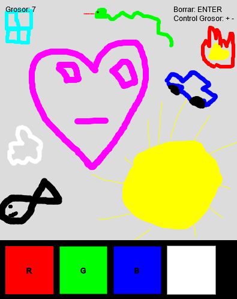

# Paint

## Autor

* Héctor Henríquez Cabrera
* Correo: [hector.henriquez101@alu.ulpgc.es](mailto:hector.henriquez101@alu.ulpgc.es)
* Asignatura: Creando Interfaces de Usuario (CIU)

## Introducción

En esta octava práctica se ha realizado una aplicación mediante **p5.js**. Se compone de una ventana en la cual tienes la posibilidad de dibujar haciendo uso del ratón. Además es posible cambiar el color y el grosor del pincel seleccionándolo directamente en la aplicación.

## Demo

Como se puede apreciar la aplicación cuenta con todo lo necesario para dibujar lo que se quiera.

* Además se puede ejecutar este proyecto mediante el enlace: https://editor.p5js.org/hector.hcdev/full/YrBvtNspM

## Implementación

### Librerías

Para la implementación de esta práctica no se ha hecho uso de ninguna librería.

### Diseño

El diseño de esta práctica se opto por dejar la interfaz lo más sencilla posible, con lo que se facilita la visualización del sistema, además se muestra los controles en la propia interfaz por si el usuario tuviese alguna con respecto a estos.

### Funcionalidades

Las funcionalidades básicas han sido cubiertas, además se han añadido la posibilidad de cambiar el color mediante el uso del ratón de manera interactiva para poder obtener cualquier color mediante la selección de un código rgb.

## Controles

Todas las interrupciones manejadas en este programa han sido mediante el teclado y el ratón, por lo que se han manejado las interrupciones generadas mediante la función **keyPressed**, **keyReleased**, **mouseDragged**, **mouseReleased** y **mousePressed**. Las teclas y acciones consecuentes que las activan son:

| Tecla | Uso                            |
| ----- | ------------------------------ |
| +     | Aumentar el grosor del pincel  |
| -     | Disminuir el grosor del pincel |
| ENTER | Borrar la pizarra actual       |

## Bibliografía

* [Guion de prácticas](https://cv-aep.ulpgc.es/cv/ulpgctp20/pluginfile.php/126724/mod_resource/content/22/CIU_Pr_cticas.pdf)

* [processing.org](https://processing.org/)
* [Proyecto en p5](https://editor.p5js.org/hector.hcdev/embed/YrBvtNspM)